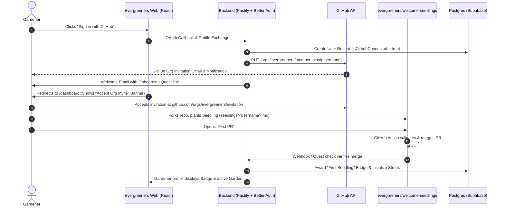

# GitHub Community Onboarding & Automation Architecture
**Modeled on Hack Club's Onboarding Engine for Evergreeners**

---

## Executive Summary

To build an active, enduring open-source community around **Evergreeners**, we need a low-friction, high-delight onboarding pipeline. Traditional open-source repositories suffer from a steep onboarding curve: new developers must find an issue, configure local environments, understand complex test suites, and face the anxiety of having their first pull request scrutinized or rejected.

**Hack Club** solved this problem and built one of the world's most active developer communities by turning the "First Pull Request" into a celebratory rite of passage rather than a technical exam.

This document details:
1. The architectural principles behind Hack Club's onboarding and organization management.
2. The Evergreeners adaptation: **The Seedling Architecture**.
3. The end-to-end user journey from Web Signup to Org Invitation, First PR, and Streak Initialization.

---

## 1. The Hack Club Playbook Deconstructed

Hack Club’s onboarding machine relies on three core pillars:

```
┌─────────────────────────────────────────────────────────────┐
│                 Hack Club Onboarding Model                  │
├──────────────────────────────┬──────────────────────────────┤
│ 1. Rite of Passage           │ 2. Dual-Org Architecture     │
│    • "Draw a Dino"           │    • @hackclub (Production)  │
│    • hackclub/dinosaurs      │    • @hackclub-community     │
│    • Zero technical risk     │    • Permission isolation    │
├──────────────────────────────┴──────────────────────────────┤
│ 3. Automated API Gateways                                   │
│    • Web Auth & Slack Bot Gateways (Toriel, Slacker)        │
│    • Automated org invites via GitHub REST API              │
└─────────────────────────────────────────────────────────────┘
```

### Pillar A: The "First PR" Rite of Passage (`hackclub/dinosaurs`)
* **The Concept**: Every new member is invited to draw "Prophet Orpheus" (their dinosaur mascot) using MS Paint, Pinta, or any simple drawing tool.
* **The Mechanics**:
  1. Member follows a step-by-step 5-minute visual guide (`hack.af/make-dino`).
  2. Member forks `hackclub/dinosaurs`.
  3. Uploads their image file (`<username>_<name>.png`).
  4. Appends their entry to `README.md`.
  5. Opens a Pull Request to `main`.
* **The Magic**:
  * **Zero Impostor Syndrome**: Nobody's drawing is "wrong" or fails a unit test.
  * **Core Skills Acquired**: The member learns forks, branches, commits, markdown, and PRs in a safe environment.
  * **Instant Gratification**: Automated workflows and welcoming maintainers merge the PR quickly. The art is deployed automatically to `rawr.hackclub.com`, and the user is celebrated with a digital dino badge.

### Pillar B: Dual-Organization Architecture
GitHub organization membership gives members visibility and community identity, but granting organization-wide access poses security risks. Hack Club balances this with a dual-organization structure:
* **`@hackclub`**: Restricted to core staff, financial infrastructure (Hack Club Bank / HCB), and production systems.
* **`@hackclub-community`**: A wide-open playground where community members are granted membership, can form teams, spin up shared repositories, and collaborate without posing a threat to production services.

### Pillar C: Automated Identity & API Gateways
Because GitHub does not offer a native public "Join Organization" button, Hack Club bridges communication channels:
* Signups through web forms or Slack invite gateways trigger automated backend scripts.
* Using tokens with `admin:org` permissions, GitHub API endpoints (`POST /orgs/{org}/invitations` or `PUT /orgs/{org}/memberships/{username}`) programmatically dispatch invites directly to members' GitHub handles.

---

## 2. The Evergreeners Adaptation: "The Seedling Architecture"

In Evergreeners, our mission is: **"Track your consistency. Grow your legacy. Stay evergreen 🌲"**.

We map Hack Club's proven onboarding engine to the Evergreeners domain model:

| Hack Club Concept | Evergreeners Equivalent | Domain Term (from CONTEXT.md) |
| :--- | :--- | :--- |
| Prophet Orpheus (Dinosaur) | **The Seedling** (Evergreen Tree / Sprout) | Digital Garden Asset |
| New Member | **Gardener** | Gardener |
| `hackclub/dinosaurs` | `evergreeners/welcome-seedlings` | Onboarding Repository |
| Dinosaur Gallery (`rawr.hackclub.com`) | **Community Garden** | Garden Showcase |
| Dino Badge | **First Seedling Badge** | Badge |
| Slack Welcome Gateways | **Better Auth OAuth + API Inviter** | Identity Integration |

### High-Level User Journey


